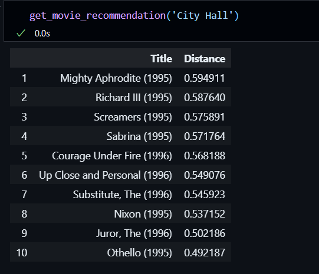
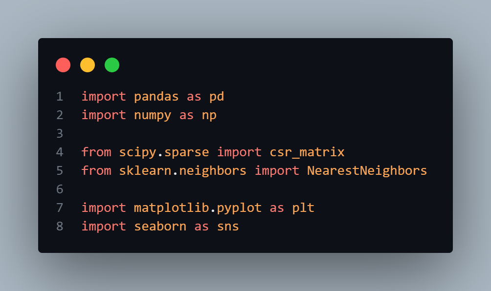

# Recommender System 🎥🤖

A **Recommender System** built using collaborative filtering techniques to suggest items (e.g., movies) to users based on their previous interactions and the preferences of similar users.

## Features

- **Collaborative Filtering**: Utilizes cosine similarity to find similar users/items.
- **Nearest Neighbors Algorithm**: Implements the `NearestNeighbors` model to compute recommendations.
- **Customizable Recommendations**: Specify the number of recommendations for each user.
- **Interactive Results**: Displays results in a user-friendly format.

---

## Technologies Used 🛠️

- **Pandas**: Data manipulation and analysis. (for csv files)
- **Scikit-learn**: Machine learning algorithms (NearestNeighbors model).
- **SciPy**: Sparse matrix handling.
- **Matplotlib/Seaborn**: Visualization of results. (like graphs or scatter plots)

---

## Dataset 📂

Movies Dataset: data\movies.csv
Ratings Dataset: data\ratings.csv

---

## How It Works 🧠

1. **Preprocessing**:

   - Load the datasets.
   - Create a user-item matrix.
   - Remove movies with fewer than 10 votes to reduce noise.
   - Remove users with fewer than 50 movies rated.

2. **Model Training**:

   - Fit a `NearestNeighbors` model using cosine similarity on the sparse matrix.(cosine similarity considered ideal here)

3. **Generating Recommendations**:

   - Query the model for the top `n_neighbors` for each user or item.

4. **Output**:
   - Display or save the recommendations in an easily interpretable format.

---

## Screenshots 📸

### Example Output

### Libraries Used

### KNN Function Using Cosine

